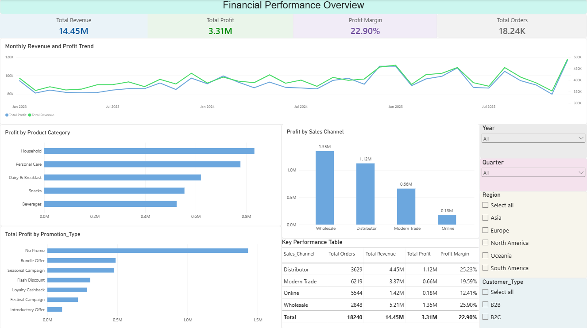
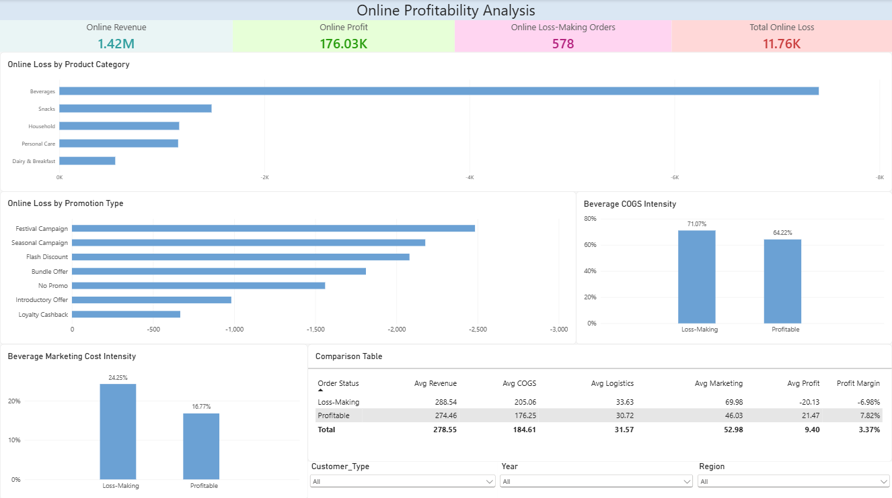

# 📊 Financial Performance and Profitability Analysis

## 📌 Project Overview

This project analyzes FMCG sales data to evaluate overall financial performance, profitability, sales channel performance, product category performance, and promotional effectiveness.

The analysis goes beyond overall sales performance to investigate **why certain orders generate losses**, with a particular focus on the Online sales channel and the factors contributing to those losses.

The project follows an end-to-end data analytics workflow using **Python for data cleaning and exploratory analysis, SQL for business analysis, and Power BI for interactive dashboards**.

---

## 🎯 Business Problem

A business can generate strong revenue while still experiencing profitability issues due to high operating costs, marketing expenses, discounts, and other cost pressures.

This project aims to answer questions such as:

- How is revenue and profit changing over time?
- Which product categories contribute most to revenue and profit?
- Which sales channels are more or less profitable?
- How do different promotion types affect profitability?
- What proportion of orders are loss-making?
- Which sales channel contributes the most to total losses?
- Why are some Online orders generating losses?
- Which product categories are responsible for Online losses?
- Are high COGS, marketing costs, logistics costs, or discounts contributing to losses?

---

## 🛠️ Tools & Technologies

### Data Cleaning & Analysis

- Python
- Pandas
- NumPy
- Matplotlib
- Jupyter Notebook

### Database Analysis

- MySQL
- SQL

### Business Intelligence

- Power BI
- DAX

### Data Format

- CSV

---

## 📂 Project Structure

~~~text
financial_performance_and_profitability/
│
├── dashboards/
│   ├── financial_performance_overview.pbix
│   └── online_profitability_analysis.pbix
│
├── datasets/
│   ├── fmcg_sales_dataset.csv
│   └── fmcg_sales_cleaned.csv
│
├── notebooks/
│   ├── FMCG_Sales_Data_Cleaning_and_Feature_Engineering.ipynb
│   └── FMCG_Sales_Profitability_Analysis.ipynb
│
├── images/
│   ├── financial_performance_overview.png
│   └── online_profitability_analysis.png
│
├── financial_performance_queries.sql
│
└── README.md

~~~

---

## 📊 Dataset Overview

The dataset contains **18,240 FMCG sales orders** with information related to sales, revenue, costs, customers, products, promotions, and sales channels.

### Key Data Areas

#### Sales Information

- Order ID
- Order Date
- Units Sold
- Unit Price
- Sales Channel
- Sales Person

#### Product Information

- Product Category
- Product Name
- Brand
- SKU

#### Customer Information

- Customer Type
- Region
- Country
- City

#### Financial Information

- Gross Sales
- Net Revenue
- COGS
- Marketing Spend
- Logistics Cost
- Profit
- Profit Margin
- Discount

#### Promotion Information

- Promotion Type
- Discount Percentage

---

## 🧹 Data Cleaning & Feature Engineering

The first Python notebook performs data validation, cleaning, and feature engineering.

### Data Validation

The dataset was checked for:

- Dataset dimensions
- Column names
- Data types
- Missing values
- Duplicate records
- Categorical values
- Profit calculation consistency
- Profit margin calculation consistency

### Feature Engineering

Additional analytical features were created, including:

- `Revenue_per_Unit`
- `Total_Cost_USD`
- `Marketing_ROI`
- `Discount_Amount_USD`
- `Year_Month`

The `Order_Date` field was also converted to a proper datetime format to support time-based analysis.

The resulting cleaned dataset was saved as:

```text
fmcg_sales_cleaned.csv
```

---

## 📈 Exploratory Data Analysis

The second Python notebook focuses on financial performance and profitability analysis.

### 1. Overall Financial Performance

The analysis evaluates:

- Total Net Revenue
- Total Cost
- Total Profit
- Profitable Orders
- Loss-Making Orders
- Loss-Making Order Percentage

Out of **18,240 orders**, **784 orders (4.30%)** were identified as loss-making.

These loss-making orders generated a total loss of approximately **$19,697.47**.

---

### 2. Sales Performance Over Time

Monthly analysis was performed to evaluate:

- Net Revenue trends
- Profit trends
- Profit Margin trends

This helps identify changes in financial performance over time and periods where profitability increases or declines.

---

### 3. Product Category Performance

Product categories were analyzed based on:

- Net Revenue
- Total Profit

This provides a comparison of revenue generation and profitability across different FMCG product categories.

---

### 4. Sales Channel Performance

Sales channels were compared using:

- Revenue
- Profit
- Profit Margin

The analysis covers the following sales channels:

- Online
- Modern Trade
- Wholesale
- Distributor

---

### 5. Promotion Performance

Promotion types were evaluated based on:

- Number of Orders
- Total Profit

This analysis helps assess how different promotional strategies are associated with overall profitability.

---

## 🔎 Loss-Making Order Investigation

A major focus of the project is understanding **why loss-making orders occur**, particularly within the Online channel.

### Overall Loss Distribution

The analysis found that:

- **784 of 18,240 orders (4.30%)** were loss-making.
- Total loss from these orders was approximately **$19,697.47**.
- The **Online channel** contributed approximately **$11,763.89** in losses.
- Online losses represented approximately **60% of total order-level losses**.

This led to a deeper investigation of Online orders.

---

### 🛒 Online Profitability Analysis

Online orders were classified into:

- Loss-Making
- Profitable

The two groups were compared across:

- Average Revenue
- Average COGS
- Average Logistics Cost
- Average Marketing Spend
- Average Discount
- Average Profit
- Average Profit Margin

The analysis then investigated the relationship between major cost components and profit.

---

### 💰 Marketing Spend vs Profit

The relationship between marketing spend and profit was examined using:

- Scatter plot analysis
- Correlation analysis

The correlation between **Marketing Spend and Profit** was approximately:

**0.127**

This indicates a relatively weak positive linear relationship in the analyzed data.

---

### 📦 COGS vs Profit

COGS was also analyzed against profit using:

- Scatter plot analysis
- Correlation analysis

The correlation between **COGS and Profit** was approximately:

**0.433**

This was stronger than the marketing spend correlation and indicates that COGS had a more noticeable relationship with profit in the analyzed Online orders.

---

## 🥤 Online Beverage Loss Analysis

The investigation identified **Beverages** as the primary contributor to Online losses.

### Key Findings

- Online Beverage orders contributed approximately **$7,407.87** in losses.
- This represented approximately **62.97% of total Online losses**.
- Loss-making Online Beverage orders generated an average revenue of approximately **$288.54**.
- Profitable Online Beverage orders generated an average revenue of approximately **$274.46**.

This indicates that the loss-making orders were **not primarily caused by lower revenue**.

Instead, the analysis found greater cost pressure in loss-making Beverage orders.

---

### 📊 Cost Structure of Online Beverage Orders

For loss-making Online Beverage orders:

- COGS represented approximately **71.07% of revenue**.
- Marketing represented approximately **24.25% of revenue**.

For profitable Online Beverage orders:

- COGS represented approximately **64.22% of revenue**.
- Marketing represented approximately **16.77% of revenue**.

This shows that loss-making Beverage orders had substantially higher COGS and marketing cost intensity relative to revenue.

---

## 💡 Key Findings

### 1. Online Channel is the Primary Loss Contributor

Only **4.30% of all orders** were loss-making, but losses were concentrated in the Online channel.

Online orders generated approximately **$11,763.89 in losses**, representing around **60% of total order-level losses**.

### 2. Beverages are the Main Driver of Online Losses

Beverage orders accounted for approximately **62.97% of Online losses**, with total losses of approximately **$7,407.87**.

### 3. Losses Are Not Primarily Driven by Low Revenue

Loss-making Online Beverage orders had higher average revenue than profitable Beverage orders:

- Loss-making: **$288.54**
- Profitable: **$274.46**

Therefore, increasing revenue alone may not address the underlying profitability issue.

### 4. COGS is a Major Cost Pressure

COGS represented approximately:

- **71.07%** of revenue for loss-making Online Beverage orders
- **64.22%** of revenue for profitable Online Beverage orders

The higher COGS burden reduces the revenue available to cover other operating costs.

### 5. Marketing Spend is Another Cost Pressure

Marketing represented approximately:

- **24.25%** of revenue for loss-making Online Beverage orders
- **16.77%** of revenue for profitable Online Beverage orders

This highlights the importance of evaluating marketing expenditure alongside the profitability it generates.

### 6. Promotions Are Not the Sole Cause of Losses

Beverage losses occurred across multiple promotion types, including orders with **No Promo**.

Therefore, the analysis does not attribute the Online Beverage profitability issue to a single promotional campaign.

---

## 💼 Business Recommendations

Based on the analysis:

### Online Channel

- Closely monitor Online channel profitability.
- Establish regular margin tracking for Online orders.
- Monitor loss-making orders by product category.

### Beverage Category

- Prioritize Beverage products when reviewing Online pricing and costs.
- Investigate product-level margins within the Beverage category.
- Review supplier and procurement costs.

### Marketing

- Evaluate the profitability of Online Beverage marketing campaigns.
- Compare marketing expenditure with the profit generated by the associated orders.
- Optimize spending where marketing costs do not generate sufficient profitability.

### Promotions

- Evaluate promotions based on their impact on product-level margins.
- Avoid treating promotions as the sole explanation for losses.
- Analyze promotion profitability at the product and channel level.

---

## 🗃️ SQL Analysis

The `financial_performance_queries.sql` script contains SQL-based business analysis supporting the profitability investigation.

The analysis covers areas such as:

- Overall sales performance
- Revenue and profit analysis
- Product category profitability
- Sales channel performance
- Promotion performance
- Loss-making orders
- Online channel losses
- Product category losses
- Cost and profitability comparisons
- Salesperson profitability analysis

---

## 📊 Power BI Dashboards

The project contains two interactive Power BI dashboards.

### Dashboard 1 — Financial Performance Overview

**File:**

```text
dashboards/financial_performance_overview.pbix
```


This dashboard provides an overall view of financial performance, including:

- Revenue
- Profit
- Profit Margin
- Sales trends
- Product category performance
- Sales channel performance
- Promotion performance

---

### Dashboard 2 — Online Profitability Analysis

**File:**

```text
dashboards/online_profitability_analysis.pbix
```




This dashboard focuses specifically on Online profitability and loss-making orders.

It provides analysis of:

- Online revenue and profit
- Loss-making orders
- Loss distribution
- Product category losses
- Cost components
- COGS
- Marketing spend
- Discounts
- Promotion performance

---

# 🔄 Project Workflow

```text
Raw FMCG Dataset
       ↓
Data Validation & Cleaning
       ↓
Feature Engineering
       ↓
Cleaned Dataset
       ↓
Exploratory Data Analysis
       ↓
Profitability & Loss Investigation
       ↓
SQL Business Analysis
       ↓
Power BI Dashboards
       ↓
Business Insights & Recommendations
```

---

## 📁 Project Files

| Folder / File | Description |
|---|---|
| `dashboards/` | Power BI dashboard files |
| `financial_performance_overview.pbix` | Overall financial performance dashboard |
| `online_profitability_analysis.pbix` | Online profitability and loss analysis dashboard |
| `datasets/` | Raw and cleaned FMCG datasets |
| `fmcg_sales_dataset.csv` | Original FMCG sales dataset |
| `fmcg_sales_cleaned.csv` | Cleaned and feature-engineered dataset |
| `notebooks/` | Python analysis notebooks |
| `FMCG_Sales_Data_Cleaning_and_Feature_Engineering.ipynb` | Data cleaning and feature engineering |
| `FMCG_Sales_Profitability_Analysis.ipynb` | EDA and profitability analysis |
| `financial_performance_queries.sql` | SQL business analysis queries |

---

## 🚀 Future Enhancements

Potential extensions to the project include:

- Product-level profitability analysis
- Customer profitability segmentation
- Predictive profit modeling
- Automated loss-order alerts
- Marketing ROI optimization
- Supplier cost analysis
- Machine learning-based profitability prediction

---

## 👨‍💻 Author

**Alive Peterson**

**Skills:** Python • SQL • MySQL • Power BI • DAX • Pandas • NumPy • Matplotlib • Data Cleaning • Exploratory Data Analysis • Data Visualization

---

## ⭐ Project Highlights

- ✅ **18,240 FMCG sales orders analyzed**
- ✅ End-to-end financial performance analysis
- ✅ Python-based data cleaning and feature engineering
- ✅ Exploratory profitability analysis
- ✅ SQL-based business analysis
- ✅ Two interactive Power BI dashboards
- ✅ Detailed investigation of loss-making orders
- ✅ Online channel profitability investigation
- ✅ Product category and cost-driver analysis
- ✅ Business insights and recommendations