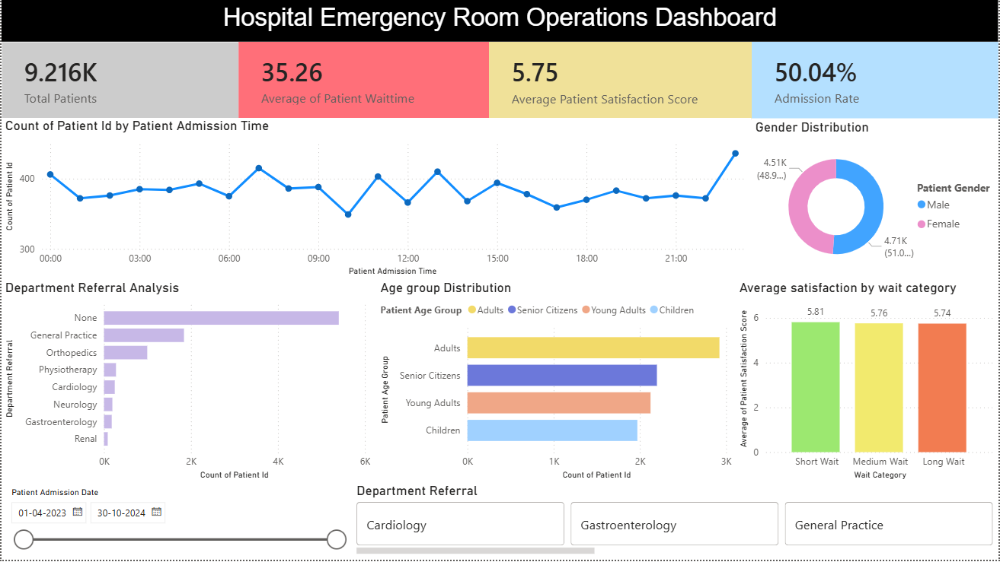

# Hospital Emergency Room Analytics Dashboard
## Project Overview

This project analyzes Emergency Room (ER) operations using SQL and Power BI to uncover insights into patient volume, waiting times, admissions, satisfaction levels, and departmental referrals.

The dashboard helps healthcare administrators monitor ER performance, identify operational bottlenecks, and improve patient experience through data-driven decision-making.

## Project Objectives
 - Monitor overall ER patient traffic.
 - Analyze patient waiting times and service efficiency.
 - Evaluate patient satisfaction levels.
 - Understand admission and discharge patterns.
 - Identify the most frequently referred departments.
 - Discover trends across age groups and demographics.

### Tools & Technologies
Power BI – Dashboard creation and data visualization
SQL – Data analysis and KPI extraction
DAX – Calculated measures and business metrics
Excel/CSV – Data storage and preprocessing

### Project Files

- Hospital_er_dashboard.pbix	Interactive Power BI dashboard
- er_analysis.sql	SQL queries used for KPI and business analysis
- er_data.csv	Cleaned analytical dataset
- Hospital ER_Data_Raw.csv	Raw ER patient dataset

### Dataset Information

The dataset contains 9,216 patient records and includes:

Patient demographics
Admission information
Waiting times
Satisfaction scores
Department referrals
Age groups
Gender distribution
Admission status
Key Attributes
Patient ID
Admission Date & Time
Gender
Age
Race
Department Referral
Admission Flag
Satisfaction Score
Wait Time
Age Group
Wait Category

### Dashboard KPIs

The dashboard tracks:

Patient Metrics
Total Patients
Average Wait Time
Average Satisfaction Score
Admission Rate
Operational Metrics
Department Referral Analysis
Wait Category Distribution
Demographic Metrics
Gender Distribution
Age Group Analysis

### Key Insights
- Patient Volume
The ER handled 9,216 patient visits during the analysis period.

- Waiting Time
Average patient waiting time was approximately 35.26 minutes.

- Patient Satisfaction
Average satisfaction score was approximately 5.75 / 10.

- Admission Trends
Admissions and non-admissions were almost evenly distributed:
Admitted: ~50%
Not Admitted: ~50%

- Department Referrals
Most referred departments included:

General Practice
Orthopedics
Physiotherapy
Cardiology
Neurology

- Demographic Analysis
Patient visits were segmented by age groups and gender.
The dashboard highlights which demographics contribute most to ER traffic.

### Dashboard Features
Executive Summary

Provides a quick overview of:

Total Patients
Average Wait Time
Satisfaction Score
Admission Rate
Wait Time Analysis
Short Wait
Medium Wait
Long Wait
Department Referral Analysis

Identifies departments receiving the highest patient referrals.

Patient Demographics

Breakdowns by:

Age Group
Gender
Race
Time-Based Analysis
Monthly patient trends
Peak visit periods
Daily traffic patterns
💡 Business Value

This dashboard enables hospital management to:

Improve patient flow management
Reduce waiting times
Monitor patient satisfaction
Allocate resources more effectively
Identify high-demand departments
Support data-driven operational decisions
📷 Dashboard Preview

Add screenshots of your Power BI dashboard here.

Example:

### SQL Analysis 

The project contains SQL queries for:

Total patient calculations
Average waiting time
Satisfaction analysis
Admission statistics
Department referral analysis
Gender distribution
Age group segmentation
Peak day analysis
Monthly trend analysis

### 👨‍💻 Author

GitHub: Alive-Peterson