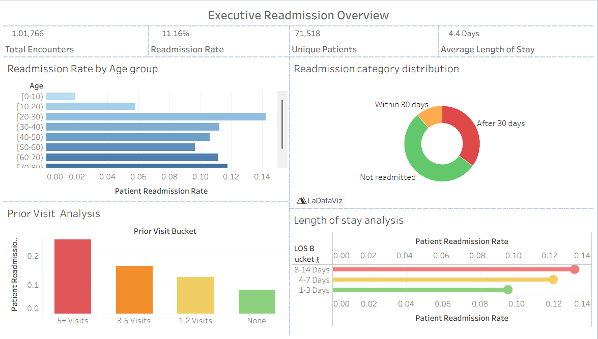
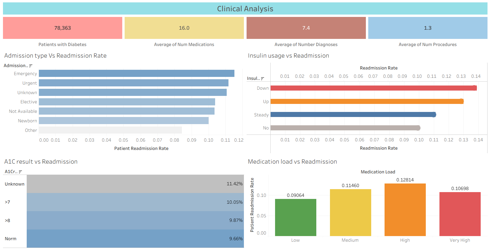

# Hospital Readmission Analysis for Diabetic Patients
## Project Overview

Hospital readmissions are a major challenge in healthcare, impacting patient outcomes and increasing healthcare costs. This project analyzes diabetic patient records to identify factors associated with hospital readmissions and uncover actionable insights that can help healthcare providers improve patient care.

The project includes data cleaning using Python and interactive visual analytics using Tableau.

### Business Problem

Hospital administrators need to understand:

- Which patients are at higher risk of readmission.
- How demographic and clinical factors influence readmission rates.
- Whether hospital stay duration, medications, or procedures impact patient outcomes.
- Opportunities to reduce avoidable readmissions and improve care quality.

### 🛠️ Tools & Technologies
- Python
- Pandas
- NumPy
- Jupyter Notebook
- Tableau
- Interactive dashboards
- Data visualization
- CSV Datasets
- Raw patient records
- Cleaned analytical dataset

### 📂 Project Files

* data_cleaning.ipynb	- Data cleaning and preprocessing workflow
* diabetic_data.csv	- Original dataset containing diabetic patient records
* hospital_readmission_final.csv - Cleaned and transformed dataset used for analysis
* hospital_readmission_insights.twb -	Tableau dashboard and visual analytics workbook
### Dataset Overview

The dataset contains over 100,000 patient encounters and includes:

- Demographic information
- Admission details
- Medical specialty
- Diagnosis codes
- Laboratory procedures
- Medication usage
- Hospital stay duration
- Previous inpatient/outpatient visits
- Readmission status

- Key Features
 - Race
 - Gender
 - Age Group
 - Time in Hospital
 - Number of Medications
 - Number of Diagnoses
 - Laboratory Procedures
 - Inpatient Visits
 - Emergency Visits
 - Admission Type
 - Discharge Disposition
 - Medical Specialty
 - Diabetes Medication Information

### Data Cleaning Process

The data preparation workflow included:

- Handling Missing Values
- Replaced placeholder values (?) with null values.
- Identified columns with excessive missing data.
- Removed columns with insufficient data quality.
- Data Transformation
- Cleaned categorical variables.
- Standardized feature values.
- Prepared data for visualization and analysis.
- Feature Engineering
- Created analysis-ready fields.
- Optimized dataset structure for Tableau reporting.

### Analysis Objectives

The dashboard investigates:

- Readmission Trends
- Overall readmission rates
- Distribution of readmission categories
- Demographic Analysis
- Readmissions by age group
- Readmissions by gender
- Readmissions by race
- Clinical Analysis
- Impact of hospital stay duration
- Medication usage patterns
- Number of diagnoses vs readmission rates
- Laboratory procedure trends
- Healthcare Utilization
- Previous inpatient visits
- Emergency room visits
- Outpatient visits

### Dashboard Features
Executive Summary

Provides a high-level view of:

- Total Patient Encounters
- Readmission Distribution
- Average Hospital Stay
- Patient Demographics
- Demographic Insights
- Age-based readmission patterns
- Gender comparisons
- Race distribution analysis
- Clinical Insights
- Medication trends
- Diagnosis frequency
- Procedure utilization
- Utilization Analysis
- Inpatient history
- Emergency visits
- Outpatient activity

###  Key Questions Answered
1. Which age groups experience the highest readmission rates?
2. Does longer hospitalization correlate with readmissions?
3. How do medication counts affect patient outcomes?
4. Which patient groups require additional follow-up care?
5. What clinical factors are associated with repeat admissions?

### Business Impact

This project helps healthcare organizations:

- Identify high-risk patients earlier.
- Improve discharge planning.
- Reduce avoidable readmissions.
- Optimize healthcare resources.
- Support data-driven clinical decision-making.

### Dashboard Preview

### Future Enhancements
- Predictive modeling for readmission risk.
- Machine learning classification models.
- Patient risk scoring system.
- Real-time healthcare monitoring dashboard.

### 👨‍💻 Author

GitHub : Alive-Peterson

### Project Highlights

- 100,000+ patient records analyzed
- End-to-end data cleaning in Python
- Interactive Tableau dashboard
- Healthcare-focused business insights
- Real-world hospital readmission use case