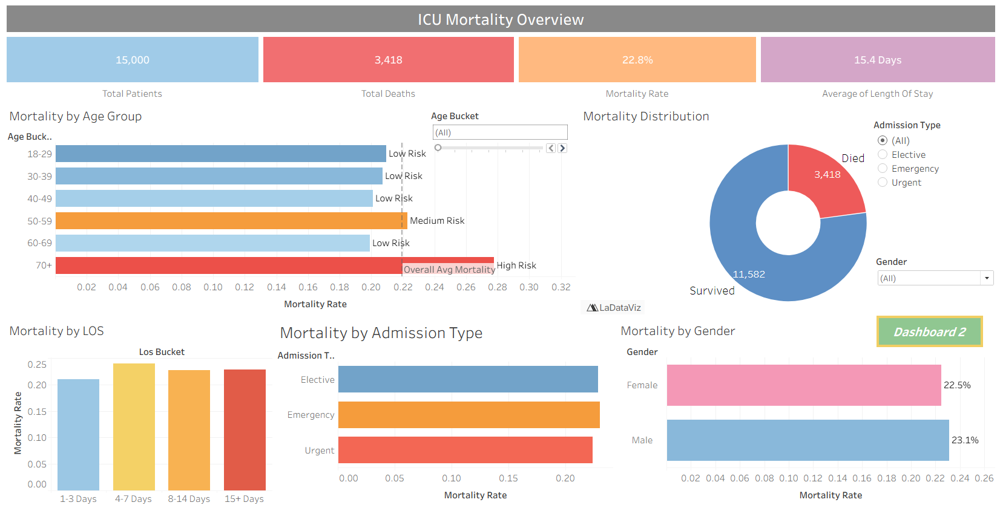
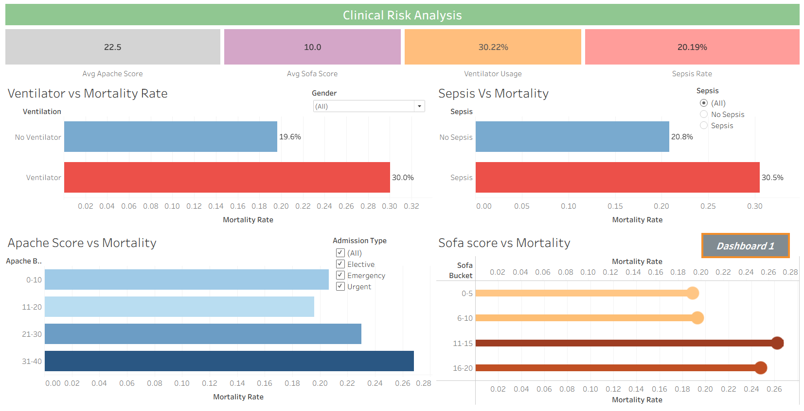

# ICU Mortality & Risk Analysis Dashboard
## Project Overview

This project analyzes Intensive Care Unit (ICU) patient data to identify key mortality risk factors and uncover actionable healthcare insights. Using Python for data preparation, SQL for analytical querying, and Tableau for visualization, the project explores how patient demographics, severity scores, vital signs, and clinical interventions impact survival outcomes.

The analysis aims to support healthcare professionals in identifying high-risk patients and improving critical care decision-making.

### Business Problem

ICUs care for critically ill patients where early risk identification is crucial. Healthcare organizations need data-driven methods to understand:

1. Which patients are at the highest risk of mortality.
2. How severity scores relate to patient outcomes.
3. The impact of sepsis and comorbidities.
4. Resource utilization patterns within the ICU.
5. Opportunities to improve patient survival rates.

### Tools & Technologies
- Data Cleaning & Analysis
- Python
- Pandas
- NumPy
- Jupyter Notebook
- Data Querying
- SQL
- Data Visualization
- Tableau

### Project Files
File	Description
ICU_mortality.ipynb    - 	Data cleaning and exploratory analysis
icu_mortality.csv	   -    Raw ICU patient dataset
icu_mortality_clean.csv -	Cleaned dataset for analysis
icu_mortality and risk analysis.sql - 	SQL queries for mortality and risk-factor analysis
ICU_Mortality_&_Risk_Analysis.twbx -	Interactive Tableau dashboard

### Dataset Overview

The dataset contains ICU patient records with information on:

* Demographics
  * Age
  * Gender
  * Admission Type

* Clinical Indicators
  * APACHE Score
  * SOFA Score
  * Comorbidity Score
  * Sepsis Status

* Vital Signs
  * Heart Rate
  * Blood Pressure
  * Respiratory Rate
  * Oxygen Saturation (SpO₂)
  * Temperature

* Laboratory Measures
  * Glucose
  * Lactate Levels

* Clinical Interventions
  * Mechanical Ventilation
  * Vasopressor Usage

* Outcomes
  * Length of Stay
  * Mortality Status

### Data Preparation

Data preprocessing included:

 - Missing value treatment
 - Duplicate removal
 - Data validation
 - Feature engineering
 - Risk category creation
 - Data quality checks

Engineered Features:
 - Age Group Categories
 - Length of Stay Buckets
 - APACHE Risk Levels
 - SOFA Risk Levels

### Analysis Objectives

- Mortality Analysis
- Overall mortality rate
- Mortality by age group
- Mortality by gender
- Mortality by admission type

Severity Assessment
- APACHE score trends
- SOFA score trends
- Risk category comparisons

Clinical Risk Factors
- Sepsis-related mortality
- Comorbidity impact
- Intervention effectiveness

Resource Utilization
- Ventilator usage
- Vasopressor administration
- Length of stay analysis

Dashboard Features
Executive Overview Provides a summary of:

- Total ICU Patients
- Mortality Rate
- Average Length of Stay
- Average Severity Scores

Mortality Risk Analysis
- Mortality by age group
- Mortality by gender
- Mortality by admission type

Clinical Risk Factors
- APACHE score distribution
- SOFA score distribution
- Sepsis impact analysis

Intervention Analysis
- Ventilator usage outcomes
- Vasopressor usage outcomes

Patient Outcome Analysis
- Survivors vs Non-survivors
- Length of stay comparisons

### Key Questions Answered
1. Which patient groups experience the highest mortality?
2. How do APACHE and SOFA scores correlate with mortality?
3. Does sepsis significantly increase mortality risk?
4. Which interventions are associated with critical outcomes?
5. How does ICU stay duration relate to survival?

### Business Impact

This project helps healthcare providers:

- Identify high-risk patients earlier.
- Improve ICU resource allocation.
- Support evidence-based clinical decisions.
- Monitor mortality-related trends.
- Enhance patient outcome management.
- Reduce preventable critical care complications.

📷 Dashboard Preview

### SQL Analysis Included

The SQL component explores:

- Mortality rates
- Risk segmentation
- Severity score analysis
- Sepsis impact assessment
- Demographic trends
- Clinical intervention analysis
- Length of stay analysis

### Future Enhancements
- Predictive Modeling
- Mortality prediction model
- Risk scoring engine
- Survival probability forecasting
- Advanced Analytics
- Machine Learning classification
- Explainable AI techniques
- Feature importance analysis
- Dashboard Enhancements
- Real-time ICU monitoring
- Hospital benchmarking
- Interactive patient risk explorer

### Author

GitHub: Alive-Peterson

### Project Highlights
- End-to-end healthcare analytics project
- Python-based data cleaning and feature engineering
- SQL-driven mortality analysis
- Interactive Tableau dashboard
- Critical care and risk assessment focus
- Portfolio-ready healthcare analytics case study