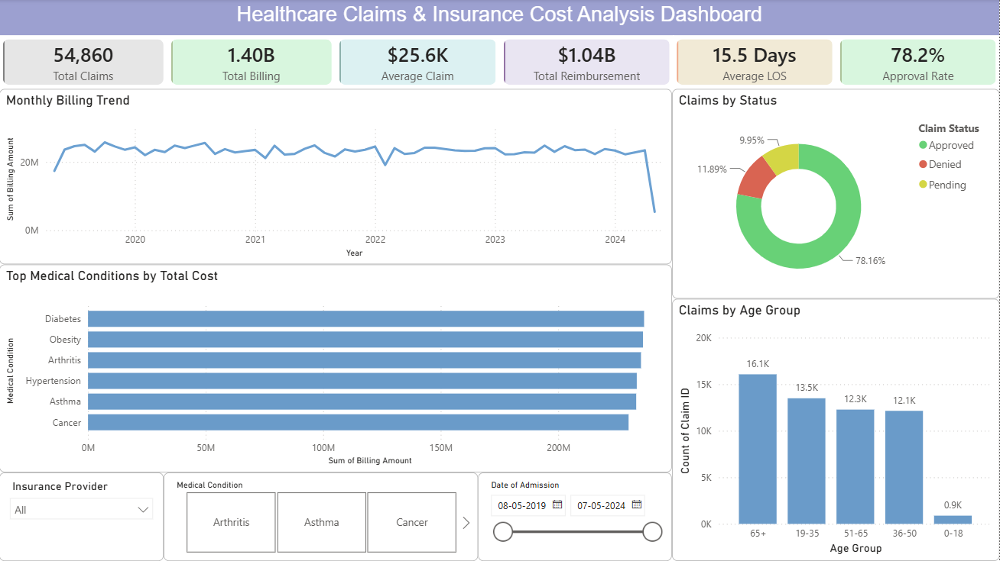

# 🏥 Healthcare Claims and Insurance Cost Analysis

## 📌 Project Overview

Healthcare insurance providers process large volumes of claims, and understanding claim patterns is essential for controlling costs, detecting high-expense areas, and improving operational efficiency. This project analyzes healthcare claims data to uncover trends in insurance costs, claim approvals, patient demographics, provider performance, and service utilization.

Using **Python** for data cleaning and exploratory analysis, **SQL** for business-driven insights, and **Power BI** for interactive dashboard reporting, this project provides a comprehensive view of healthcare insurance operations.

---

## 🎯 Business Problem

Insurance companies need to answer critical questions such as:

- Which services generate the highest claim costs?
- What factors influence claim approval rates?
- Which age groups incur the highest healthcare expenses?
- Which providers contribute most to total claim amounts?
- How do approved and denied claims differ in value?
- Are there seasonal or monthly trends in claim costs?

This analysis helps support **cost optimization, risk assessment, and data-driven insurance decision-making**.

---

## 🛠️ Tools & Technologies

### Data Cleaning & Analysis
- Python
- Pandas
- NumPy
- Jupyter Notebook

### Database Analysis
- SQL

### Business Intelligence
- Power BI
- DAX

### Data Source
- CSV Files

---

## 📂 Project Structure

```text
Healthcare-Claims-and-Insurance-Cost-Analysis/
│
├── datasets/
│   ├── healthcare_claims_clean.csv
│   └── healthcare_dataset_raw.csv
│
├── sql_analysis/
│   ├── business_analysis_queries.sql
│   └── setup_data_modification.sql
│
├── EDA.ipynb
├── health_care_insurance_cost_analysis.ipynb
├── healthcare_claims_dashboard.pbix
└── README.md
```

---

## 📊 Dataset Overview

The project includes both **raw and cleaned healthcare claims datasets** containing information related to:

- Patients
- Insurance claims
- Claim amounts
- Approval status
- Healthcare providers
- Medical services
- Treatment costs
- Demographics

### Key Analytical Areas

- Claim amount analysis
- Insurance approval trends
- Provider-wise cost analysis
- Patient demographic analysis
- Service utilization patterns

---

## 🧹 Data Preparation

The data cleaning process included:

- Handling missing values
- Removing duplicate records
- Standardizing categorical values
- Correcting data types
- Validating claim amounts
- Preparing analysis-ready datasets

---

## 📈 Project Objectives

### Claim Analysis
- Analyze total and average claim amounts
- Compare approved vs denied claims
- Identify high-cost claim categories

### Cost Analysis
- Provider-wise claim costs
- Service-wise healthcare expenses
- Monthly cost trends

### Demographic Analysis
- Age group analysis
- Gender-wise claim comparison
- Patient distribution

### Operational Analysis
- Claim approval rates
- Claim processing trends
- Cost concentration analysis

---

## 📊 Power BI Dashboard

The interactive dashboard provides a comprehensive view of healthcare insurance performance.

### Key KPIs

- Total Claims
- Total Claim Amount
- Average Claim Amount
- Approval Rate
- Denial Rate
- Total Approved Cost

### Visualizations

- Monthly Claim Trend
- Approved vs Denied Claims
- Claim Amount by Service
- Claim Amount by Provider
- Age Group Cost Analysis
- Gender-wise Claim Distribution
- Top High-Cost Providers

---

## 🗃️ SQL Analysis

The SQL scripts include:

### `setup_data_modification.sql`
- Database setup
- Table creation
- Data preparation
- Data modification operations

### `business_analysis_queries.sql`
- Total claim calculations
- Approval rate analysis
- Provider cost analysis
- Service-wise expense analysis
- Demographic comparisons
- Monthly trend analysis
- High-cost claim identification

---

## 💡 Key Insights

- Identified services contributing most to insurance costs.
- Compared financial impact of approved and denied claims.
- Highlighted providers with the highest claim amounts.
- Revealed demographic groups with higher healthcare expenses.
- Analyzed monthly fluctuations in claim volume and cost.
- Detected areas with potential cost optimization opportunities.

---

## 💼 Business Value

This project helps insurance and healthcare organizations to:

- Monitor claim costs effectively
- Improve financial planning
- Identify high-risk cost areas
- Optimize provider management
- Support fraud and anomaly investigation
- Enhance decision-making through analytics

---

## 📷 Dashboard Preview

Add screenshots of your Power BI dashboard here.

```markdown

```

---

## 🚀 Future Enhancements

- Claim fraud detection using machine learning
- Cost prediction models
- Provider risk scoring
- Patient risk segmentation
- Real-time claims monitoring dashboard

---

## 👨‍💻 Author

**Alive**

Aspiring Data Analyst

**Skills:** Python • SQL • Power BI • DAX • Data Cleaning • Data Visualization • Healthcare Analytics

---

## ⭐ Project Highlights

- ✅ End-to-end healthcare analytics project
- ✅ Raw and cleaned dataset workflow
- ✅ Python-based EDA and preprocessing
- ✅ SQL-driven business insights
- ✅ Interactive Power BI dashboard
- ✅ Insurance and claims cost analysis
- ✅ Portfolio-ready healthcare use case