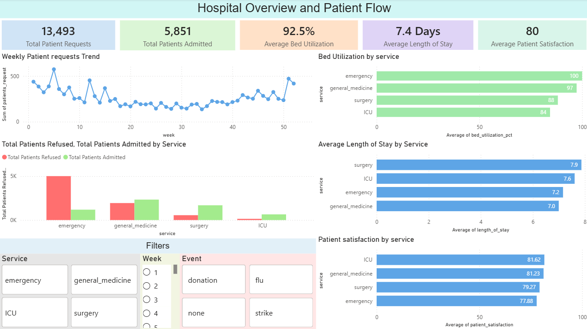
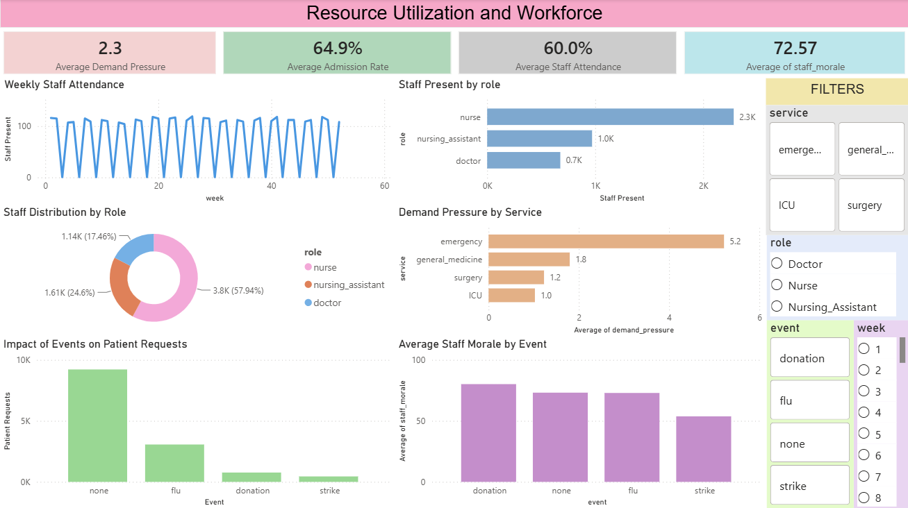

# 🏥 Hospital Bed Occupancy & Resource Utilization Analysis

## 📌 Project Overview

Efficient hospital resource management is essential for delivering quality patient care while minimizing operational costs. This project analyzes hospital bed occupancy, patient flow, staff attendance, and service utilization to uncover trends that support better healthcare planning and decision-making.

Using **Python** for data cleaning and exploratory analysis, **SQL** for business-driven insights, and **Power BI** for interactive dashboards, this project provides a comprehensive view of hospital operations.

---

## 🎯 Business Problem

Hospitals must balance patient demand with available beds, medical staff, and healthcare services. Poor resource allocation can lead to overcrowding, longer patient stays, and reduced quality of care.

This project helps answer questions such as:

- Which hospital services experience the highest bed utilization?
- Are staffing levels sufficient during high-demand periods?
- Which services have the highest patient refusal rates?
- How does patient satisfaction vary across hospital services?
- How do flu outbreaks affect hospital occupancy and staffing?

---

## 🛠️ Tools & Technologies

### Data Cleaning & Analysis
- Python
- Pandas
- NumPy
- Jupyter Notebook

### Database Analysis
- SQL

### Business Intelligence
- Power BI
- DAX

### Data Source
- CSV Files

---

## 📂 Project Structure

```text
Hospital-Bed-Occupancy-Analysis/
│
├── dashboards/
│   ├── hospital_overview.pbix
│   └── resource_utilization.pbix
│
├── datasets_raw/
│   ├── patients.csv
│   ├── staff.csv
│   ├── staff_schedule.csv
│   └── services_weekly.csv
│
├── datasets_cleaned/
│   ├── patients_clean.csv
│   ├── staff_clean.csv
│   ├── staff_schedule_clean.csv
│   └── services_weekly_clean.csv
│
├── eda_notebook.ipynb
├── hospital_bed_occupancy_and_resource_utilization.ipynb
├── SQL_Analysis.sql
└── README.md
```

---

## 📊 Dataset Overview

The project combines four hospital datasets to analyze operational performance.

### 🧑 Patients

Contains patient-level information including:

- Admission and discharge dates
- Length of stay
- Hospital service
- Bed occupancy
- Patient satisfaction
- Refusal status

### 👨‍⚕️ Staff

Contains staff information including:

- Staff ID
- Department
- Role
- Assigned service

### 📅 Staff Schedule

Tracks employee attendance and scheduling.

Includes:

- Weekly attendance
- Present / Absent status
- Staff availability

### 🏥 Weekly Service Performance

Weekly operational metrics for each hospital service.

Includes:

- Bed utilization
- Patient demand
- Refusal rate
- Average length of stay
- Flu season indicator

---

## 🧹 Data Preparation

The data preprocessing pipeline included:

- Handling missing values
- Removing duplicate records
- Standardizing column names
- Correcting inconsistent data types
- Creating analytical features
- Preparing datasets for SQL and Power BI

---

## 📈 Project Objectives

The analysis focuses on:

### Hospital Operations
- Monitor bed occupancy
- Analyze service demand
- Evaluate patient flow

### Resource Utilization
- Staff attendance trends
- Bed utilization efficiency
- Department performance

### Patient Experience
- Patient satisfaction
- Average length of stay
- Admission patterns

### Seasonal Trends
- Flu season impact
- Weekly demand changes
- Resource availability

---

# 📊 Dashboard 1 — Hospital Overview

This dashboard provides an executive summary of hospital performance.

### Key KPIs

- Total Patients
- Average Bed Occupancy
- Average Length of Stay
- Average Admission Rate
- Average Patient Satisfaction

### Visualizations

- Monthly Patient Trend
- Service-wise Bed Utilization
- Patient Satisfaction by Service
- Length of Stay Comparison
- Admission Rate Trend
- Patient Distribution by Service

---

# 📊 Dashboard 2 — Resource Utilization

Focused on operational efficiency and workforce management.

### Key KPIs

- Average Staff Attendance
- Average Refusal Rate
- Average Bed Utilization
- Weekly Patient Demand
- Flu Week Percentage

### Visualizations

- Staff Attendance Trend
- Refusal Rate by Service
- Weekly Demand Analysis
- Flu Week vs Demand
- Bed Utilization Comparison
- Staff Availability by Department

---

## 🗃️ SQL Analysis

SQL was used to answer key business questions such as:

- Which service has the highest average bed utilization?
- Which department experiences the highest refusal rate?
- Which services have the longest average patient stay?
- How does patient satisfaction differ across services?
- Does increased patient demand lead to higher refusal rates?
- How does staff attendance vary over time?
- How do flu weeks affect hospital demand?

---

## 💡 Key Insights

- Identified services operating near full bed capacity.
- Detected departments with consistently high patient refusal rates.
- Found variations in patient satisfaction across hospital services.
- Observed seasonal increases in patient demand during flu weeks.
- Evaluated staff attendance trends and their relationship to service demand.
- Highlighted opportunities for improving hospital resource allocation.

---

## 💼 Business Value

This project enables healthcare administrators to:

- Optimize hospital bed allocation.
- Improve workforce planning.
- Reduce patient refusal rates.
- Monitor operational efficiency.
- Enhance patient satisfaction.
- Make informed, data-driven resource management decisions.

---

## 📷 Dashboard Preview






---

## 🚀 Future Enhancements

- Predict hospital bed occupancy using machine learning.
- Forecast patient demand by season.
- Develop staffing recommendation models.
- Build real-time monitoring dashboards.
- Integrate external factors such as weather and disease outbreaks.

---

## 👨‍💻 Author

**Alive-Peterson**

**Skills:** Python • SQL • Power BI • DAX • Data Cleaning • Data Visualization • Healthcare Analytics

---

## ⭐ Project Highlights

- ✅ End-to-end healthcare analytics project
- ✅ Multi-table relational data analysis
- ✅ Python-based data cleaning & EDA
- ✅ SQL-driven business insights
- ✅ Two interactive Power BI dashboards
- ✅ Real-world hospital operations use case
- ✅ Focus on resource optimization and patient care